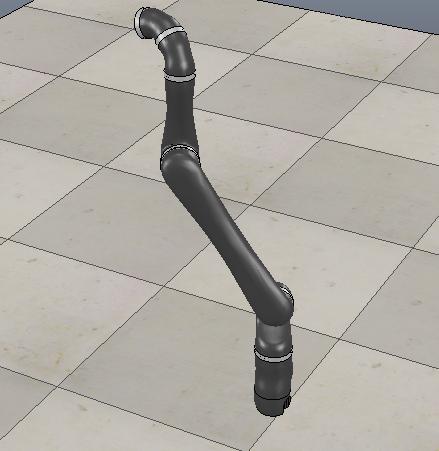
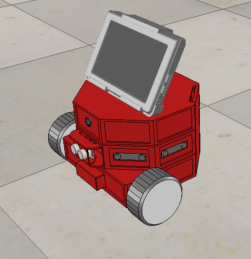
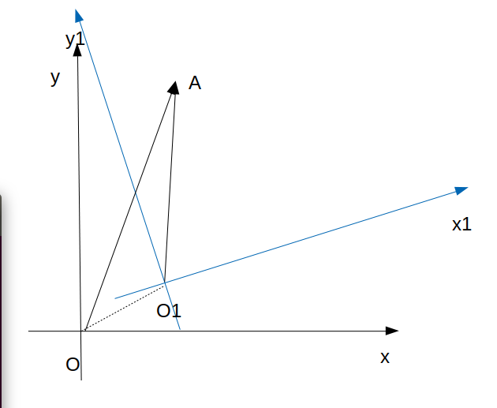
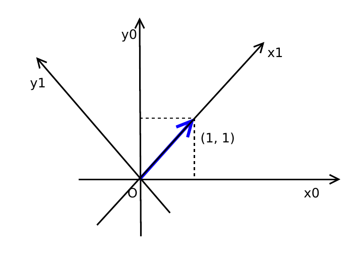
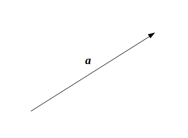
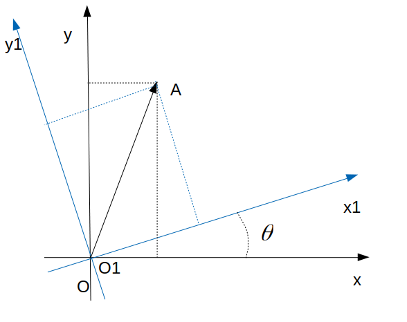
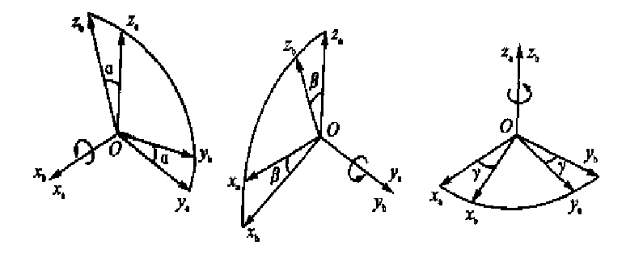
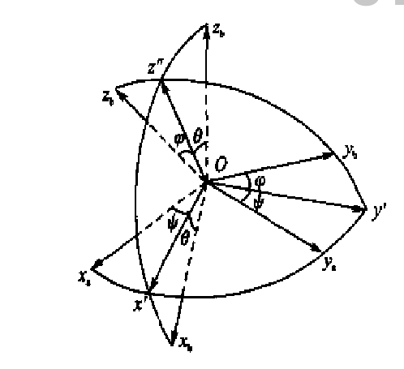
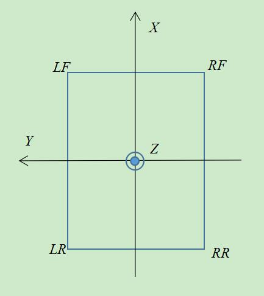
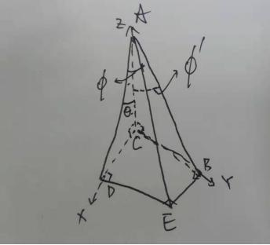

# 运动学中一些坐标系统变换

日期: 2019-06-28  
作者: 孙灿杭

内容  
1. 平面坐标系下坐标变换
2. 三维坐标系下坐标变换
3. 实例分析

## 为什么学习坐标点换 
对于运动的物体, 为了描述其空间位置, 需要建立坐标系. 就运动特性可分为, 惯性坐标系(静止不动), 运动坐标系.  
若只用一套坐标系统来描述物体的运动, 对复杂物体来说变得很困难, 如  
1. 机械臂, 每个关节的描述, 都有其独立的坐标系


2. 避障小车, 包含惯性坐标系, 本体坐标系, 相机坐标系, 超声传感器坐标系等 


在复杂系统中, 一般有多个坐标系统用来描述相应部件的位置, 速度等状态的. 相同的空间点, 在不同的坐标系下, 描述的难易程度是不一样的. 比如避障小车的超声传感器信号, 在超声传感器坐标系下与在本体坐标系下, 描述难易不一致. 那么, 如何在较难表示的坐标系统中, 表示点或者线等元素呢?   
相同物体在不同坐标系统中的描述具有一定的关系, 而这种关系可用坐标变换描述.



如, 若已知点A在Oxy坐标系内的坐标, 又知道坐标系Oxy到O1x1y1的转化关系, 就能够求出点A在坐标O1x1y1的坐标.
坐标系的关系大体可分为:
1. 旋转
2. 平移
3. 缩放
4. 仿射

下面只讲解坐标系旋转.

## 平面坐标变换
**例子**
  

矢量(向量)是指有大小和方向的量

在指定坐标系统下, 矢量$\textbf{a}$可表示为.
$$
\textbf{a} = x\textbf{i} + y\textbf{j}
$$
其中, $\textbf{i}, \textbf{j}$是坐标系的基矢量, $x,y$称作该基矢量下的坐标  

一般来说, 平时采用坐形式, 标简化矢量在指定坐标系下的表示, 如向量
$[1,2]^T$

三维坐标变换比较复杂, 首先从平面坐标变换开始


坐标系统Oxy和O1x1y1的基矢分别为$(\textbf i_0, \textbf j_0)$, $(\textbf i_1, \textbf j_1)$.坐标系O1x1y1是有坐标系Oxy旋转一定角度$\theta$得到的.  
假设矢量$\textbf{a}$在坐标系Oxy的坐标为$(x^0, y^0)$, 在坐标系O1x1y1的坐标为$(x^1, y^1)$.  
同一矢量在不同坐标系下表示是相等的, 则

$$
\textbf{a} = x^0 \textbf i_0 + y^0 \textbf j_0 = x^1 \textbf i_1 + y^1 \textbf j_1
$$

则
$$
\begin{bmatrix}
x^1 \\
y^1 \\
\end{bmatrix}
=
\begin{bmatrix}
\textbf i_1\cdot \textbf i_0 & \textbf i_1\cdot \textbf j_0 \\
\textbf j_1\cdot \textbf i_0 & \textbf j_1\cdot \textbf j_0 \\
\end{bmatrix}
\cdot
\begin{bmatrix}
x^0 \\
y^0 \\
\end{bmatrix}
$$

即
$$
\begin{bmatrix}
x^1 \\
y^1 \\
\end{bmatrix}
=
T_0^1
\cdot
\begin{bmatrix}
x^0 \\
y^0 \\
\end{bmatrix}
$$

其中
$
T_0^1 = 
\begin{bmatrix}
cos(\theta) & sin(\theta) \\
-sin(\theta) & cos(\theta) \\
\end{bmatrix}$
,$T_0^1$为坐标系Oxy到O1x1y1的转换矩阵

旋转矩阵具有如下性质
$$
(T_0^1)^{-1} = (T_0^1)^T
$$

**代码实现**


```python
import numpy as np
import math 
```


```python
theta = 90
deg2rad = math.pi / 180

# (x0, y0)
X0 = np.array([1, 1]).reshape(2,1)
T_0_1 = np.array([[math.cos(theta*deg2rad), math.sin(theta*deg2rad)],
                  [-math.sin(theta*deg2rad), math.cos(theta*deg2rad)]])
```


```python
# (x1, y1)
X1 = np.matmul(T_0_1, X0)
```


```python
print('X0:\n', X0.flatten())
print('X1:\n', X1.flatten())
```

    X0:
     [1 1]
    X1:
     [ 1. -1.]


## 三维空间坐标变换
三维空间坐标变换包括旋转矩阵, 欧拉角,四元数等. 本节重点介绍欧拉角形式的坐标转换. 坐标系绕其一轴旋转称作基元旋转.  
如图, 给出了基元旋转的三种情况, 绕x轴, y轴, z轴旋转



对应的旋转矩阵, 分别为
$$
R_x(\alpha) = 
\begin{bmatrix}
1 & 0 & 0 \\
0 & cos(\alpha) & sin(\alpha)\\
0 & -sin(\alpha) & cos(\alpha)\\ 
\end{bmatrix}
\\
R_y(\beta) = 
\begin{bmatrix}
cos(\beta) & 0 & -sin(\beta)\\
    0 & 1 & 0\\
sin(\beta) & 0 & cos(\beta)\\
\end{bmatrix}
\\
R_z(\gamma) = 
\begin{bmatrix}
cos(\gamma) & sin(\gamma) & 0\\
-sin(\gamma) & cos(\gamma) & 0\\
0 & 0 & 1\\
\end{bmatrix}
$$

任意两个坐标系转换可以通过若干次旋转实现, 常见的形式是通过三次基元旋转完成坐标变换.  
如图,


有坐标系统$Ox_ay_az_z$依次绕z轴,y轴,x轴旋转得到坐标系统$Ox_by_bz_b$, 旋转角度分别为$\psi, \theta, \phi$.

$$ 
Ox_ay_az_a\stackrel{R_z(\psi)}{\longrightarrow}Ox^\prime y^\prime z_a
\stackrel{R_y(\theta)}{\longrightarrow}Ox^b y^\prime z^{\prime\prime}
\stackrel{R_x(\phi)}{\longrightarrow}Ox_b y_b z_b
$$

那么, 坐标转换矩阵
$$
T_a^b = R_x(\phi)R_y(\theta)R_z(\psi)
$$

坐标系$Ox_ay_az_a$下的坐标转换到$Ox_by_bz_b$下, 其转换关系如下

$$
\begin{bmatrix}
x \\
y \\
z \\
\end{bmatrix}^b
=
T_a^b
\cdot
\begin{bmatrix}
x \\
y \\
z \\
\end{bmatrix}^a
$$

欧拉角形式的坐标转换一共有12种, 旋转顺序依次  
x-y-z, x-z-y, y-x-z, y-z-x, z-x-y, z-y-x,  
x-y-x, x-z-x, y-x-y, y-z-y, z-x-z, z-y-z

## 实例分析
悬架平面与底盘平面是两个不同的平面,悬架平面为空簧上支撑点与车体链接处所处平面; 底盘平面为车轴所在的平面.
针对不同的平面建立相应的坐标系统, 可以得到两个平面之间的变换关系.  

### 坐标系建立
以悬架平面为例, 建立如下坐标系$f_s$



悬架垂直方向俯视图, 坐标原点O建立在四个空簧组成矩形(或梯形)的几何中心. 在悬架平面内, $X$轴指向车头方向. $Y$轴垂直于$X$轴, 指向车体左侧.$Z$轴符合右手定则, 垂直于平面向上. $LF, RF, LR, RR$分别代表左前, 右前, 左后, 右后空簧位置

设四个空簧在悬架坐标系下的坐标为:
$$
LF: (x_1,y_1,0)\\ 
RF: (x_2,y_2,0)\\
LR: (x_3,y_3,0)\\
RR: (x_4,y_4,0)
$$

建立车体坐标系$f_b$, 固定在车辆底盘上, 原点与悬架坐标系重合,$X, Y$平面与底盘平面平行. $X$轴指向车头方向, $Y$轴指向左侧. 同样, $Z$符合右手定则

### 坐标旋转矩阵
车体坐标系到悬架坐标系转换, 采用欧拉角形式表示. 首先, 车体坐标系绕$Y$轴旋转$\theta$, 然后绕$X$轴旋转$\phi$, 最后得到悬架坐标系.    
则, 车体坐标系到悬架坐标系转换矩阵$T_b^s$

$$
T_b^s=R_x(\phi)R_y(\theta)=
\begin{bmatrix}
c\theta & 0 &-s\theta \\
s\phi s\theta & c\phi & s\phi c\theta\\
c\phi s\theta & -s\phi & c\phi c\theta\\
\end{bmatrix}
$$
其中, $s\theta, c\theta, s\phi, c\phi$分别代表三角函数$sin\theta, cos\theta, sin\phi, cos\phi$

那么,
$$
T_s^b = (T_b^s)^{T} = 
\begin{bmatrix}
c\theta & s\phi s\theta & c\phi s\theta \\
0 & c\phi & -s\phi\\
-s\theta & s\phi c\theta & c\phi c\theta \\
\end{bmatrix}
$$

### 俯仰角与侧倾角求解

悬架平面与底盘平面存在一定的夹角, 绕X轴旋转的产生的夹角称为俯仰角, 绕Y轴旋转的产生的夹角称为侧倾角.

空簧的位置坐标, 在悬架坐标系下与车体坐标系下转化关系如下
$$
X_b = T_s^b X_s
$$

实际中, 可以根据机械结构得到空簧坐标点在悬架坐标系下的坐标. 同时, 又可以通过角度传感器测量得到空簧在车体坐标系下的高度(需转化成相对车体平面的高度)  
关系如下

$$
[z_1,z_2, z_3, z_4]=
[- s\theta，s\phi c\theta ]
\begin{bmatrix}
x_1 & x_2 & x_3 &x_4\\
y_1& y_2 & y_3 & y_4
\end{bmatrix}
$$

其中, $x_i, y_i(i=1,2,3,4)$分别代表空簧在悬架坐标系下的坐标, $z_i(i=1,2,3,4)$代表空簧在车体坐标系下的相对高度.

原方程可转换成如下形式
$$
AX = b
$$

其中, 
$$
A = 
\begin{bmatrix}
x_1 & y_1 \\
x_2 & y_2 \\
x_3 & y_3 \\
x_4 & y_4 \\
\end{bmatrix}
,
b = 
\begin{bmatrix}
z_1 \\
z_2 \\
z_3 \\
z_4 \\
\end{bmatrix}
$$

$$
X = 
\begin{bmatrix}
X_1 \\
X_2 \\
\end{bmatrix}
= 
\begin{bmatrix}
-s\theta \\
s\phi c\theta \\
\end{bmatrix}
$$

根据矩阵左逆关系,
$$
\hat{X} = (A^TA)^{-1}A^Tb
$$

有以上结果, 可求出欧拉角$(\phi, \theta)$

$$
\theta = -asin(X_1) \\
\phi = asin\left (\frac{X_2}{cos\theta}\right)
$$

$\phi, \theta$只是欧拉角, 若要得到悬架相对底盘的俯仰角, 侧倾角, 可根据以下几何关系求得



悬架坐标系与车体坐标系的侧倾角(roll),俯仰角(pitch)
$$
\begin{align}
roll &= atan
\left (
\frac{tan\phi}{cos\theta}
\right ) 
\\
pitch &= \theta
\end{align}
$$

以上采用四个点的信息来估计悬架相对底盘平面的夹角, 求解过程采用了矩阵最小二乘伪逆形式求解. 但同样, 可以采用三个点, 两个点求解平面夹角问题. 步骤不变, 只需根据测量点数目, 将章节中关系式对应的维度缩减, 即可求得相应的角度值.

# 参考
1. 空间坐标变换: 
2. 伪逆: https://www.cnblogs.com/AndyJee/p/5082508.html

**代码实例**


```python
import numpy as np
import math
```


```python
deg2rad = math.pi / 180
rad2deg = 180 / math.pi
```


```python
# position in suspension frame
wide = 1000
lenght = 1250
X_LF = [lenght/2, wide/2]
X_RF = [lenght/2, -wide/2]
X_LR = [-lenght/2, wide/2]
X_RR = [-lenght/2, -wide/2]
A = np.array([X_LF, X_RF, X_LR, X_RR]).reshape(4,2)
```


```python
print('在悬架坐标系下, 空簧位置:\n', A)
```

    在悬架坐标系下, 空簧位置:
     [[ 625.  500.]
     [ 625. -500.]
     [-625.  500.]
     [-625. -500.]]


```python
# position in car-body frame
Z_measure = np.array([500, 0, 500, 0])
Z_in_b = (Z_measure - Z_measure.mean()).reshape(4,1)
b = Z_in_b
```


```python
print("在车体坐标系下, 空簧相对高度\n", Z_in_b)
```

    在车体坐标系下, 空簧相对高度
     [[ 250.]
     [-250.]
     [ 250.]
     [-250.]]


```python
A_matrix =np.matmul(np.linalg.inv(np.matmul(np.transpose(A), A)), np.transpose(A))
X_esti = np.matmul(A_matrix, b)
```


```python
theta = -math.asin(X_esti[0])
phi = math.asin(X_esti[1] / math.cos(theta))
```


```python
roll = math.atan(math.tan(phi) / math.cos(theta)) * rad2deg
pitch = theta * rad2deg
```


```python
print('phi:', phi * rad2deg)
print('theta:', theta * rad2deg)
print("侧倾角:", roll)
print("俯仰角:", pitch)
```

    phi: 30.000000000000004
    theta: -0.0
    侧倾角: 30.000000000000004
    俯仰角: -0.0


```python
A
```


    array([[ 625.,  500.],
           [ 625., -500.],
           [-625.,  500.],
           [-625., -500.]])


```python
theta1_t = 0.2
phi1_t = 0.2
a_theta = np.array([-np.sin(theta1_t), np.sin(phi1_t) * np.cos(theta1_t)]).reshape(2,1)
h_a = -np.matmul(A, a_theta)
```
